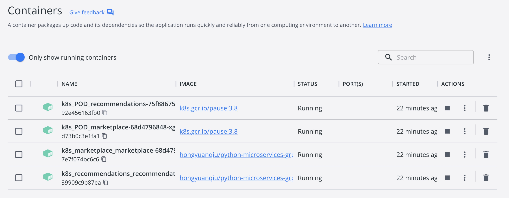

# Python-Microservices-With-gRPC
Following tutorial on Real Python

## Information
#### Docker Command Line
Re-tagging an existing local image:
```commandline
docker tag <existing-image> <hub-user>/<repo-name>[:<tag>]
```

Push a new tag to the repository:
```commandline
docker push <hub-user>/<repo-name>[:<tag>]
```

Setting replicas to 0 to "stop" the pod.
```commandline
kubectl scale --replicas=0 deployment/marketplace
```

#### Pause Pod
>Every Kubernetes Pod includes an empty pause container, which bootstraps the 
>Pod to establish all of the cgroups, reservations, and namespaces before its 
>individual containers are created. The pause container image is always 
>present, so the pod resource allocation happens instantaneously as containers 
>are created.

In the following figure, each Pod has one pause container: 




### Reference:
1. [Python Microservices With gRPC](https://realpython.com/python-microservices-grpc/)
2. [Install Protocol Buffers - IntelliJ IDEs Plugin](https://plugins.jetbrains.com/plugin/14004-protocol-buffers)
3. [Language Guide (proto3)](https://developers.google.com/protocol-buffers/docs/proto3)
4. [Push image to Docker Hub repository](https://docs.docker.com/docker-hub/repos/)
5. [How to stop/pause a pod in kubernetes](https://stackoverflow.com/questions/54821044/how-to-stop-pause-a-pod-in-kubernetes)